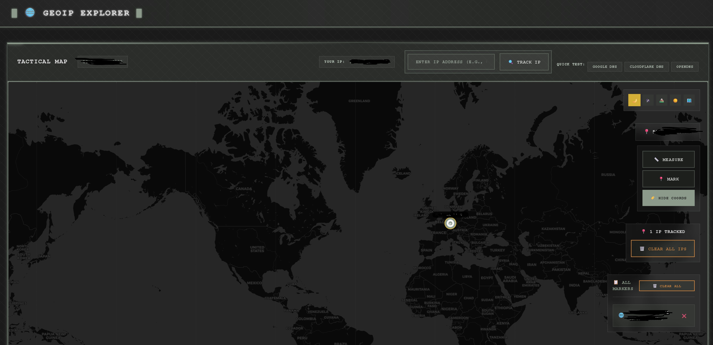
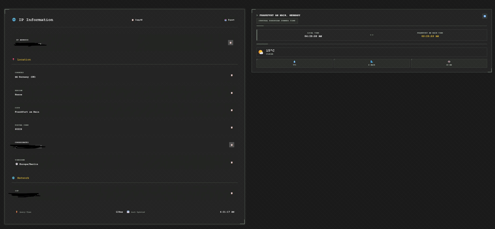

# GeoIP Explorer

  

GeoIP Explorer is an advanced IP tracking and geolocation application built with Vue 3 and Leaflet. It provides real-time IP location mapping, distance measurements, custom markers, weather information, and more. This project demonstrates modern web development practices, including state management, API integration, and interactive mapping.

Live Demo: [geoip-explorer-lokmanefe.netlify.app](https://geoip-explorer-lokmanefe.netlify.app/)

## Features

- **IP Geolocation**: Track any IP address with detailed location info (city, country, ISP, etc.)
- **Interactive Map**: Powered by Leaflet with multiple modes (dark/light/satellite)
- **Marker System**: Add IP markers, custom markers, and measurement points
- **Distance Calculation**: Measure distances between markers with polyline visuals
- **Weather & Timezone**: Real-time weather and local time for locations
- **Analytics**: Search history and usage statistics
- **Export Options**: Export data in JSON, CSV, TXT formats
- **Responsive UI**: Military/tactical theme with overlay controls
- **Multiple Modes**: Normal, Measurement, and Marker modes
- **Security Features**: Detect invalid IPs and handle errors gracefully

## Tech Stack

- **Frontend**: Vue 3 with Composition API
- **State Management**: Pinia
- **Mapping**: Leaflet.js
- **API Calls**: Axios with fallback system for reliability
- **Styling**: CSS with tactical theme
- **Build Tool**: Vite
- **TypeScript**: Full type safety
- **Linting**: ESLint + Prettier

## Installation

1. Clone the repository:

   ```bash
   git clone https://github.com/lokicik/geoip-explorer.git
   cd geoip-explorer
   ```

2. Install dependencies:

   ```bash
   npm install
   ```

3. Run locally:

   ```bash
   npm run dev
   ```

   The app will be available at `http://localhost:5173`

4. Build for production:
   ```bash
   npm run build
   ```

## Usage

- Enter an IP address in the search bar to track it
- Use the map controls to switch modes (measurement/marker)
- Click on markers for details and actions
- View weather/timezone info in the panels
- Export search data from the details panel

## Screenshots





(Replace with actual screenshots)

## Project Structure

- `src/composables/`: Custom hooks (e.g., useIpGeolocation)
- `src/components/`: Vue components (MapView, IpDetails, etc.)
- `src/stores/`: Pinia stores (analytics)
- `src/views/`: Main views (HomeView)

## Contributing

1. Fork the repository
2. Create a feature branch (`git checkout -b feature/AmazingFeature`)
3. Commit your changes (`git commit -m 'Add some AmazingFeature'`)
4. Push to the branch (`git push origin feature/AmazingFeature`)
5. Open a Pull Request

## License

Distributed under the MIT License. See `LICENSE` for more information.

## Contact

Lokman Efe - [your.email@example.com](mailto:lokman@lokmanefe.com)

Project Link: [https://github.com/lokicik/geoip-explorer](https://github.com/lokicik/geoip-explorer)
